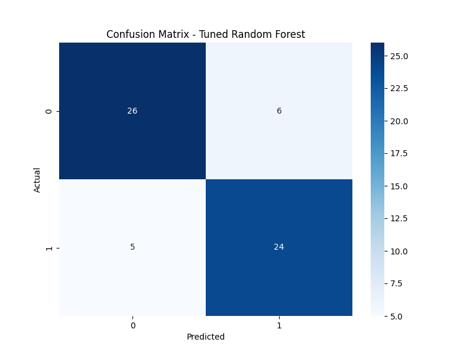
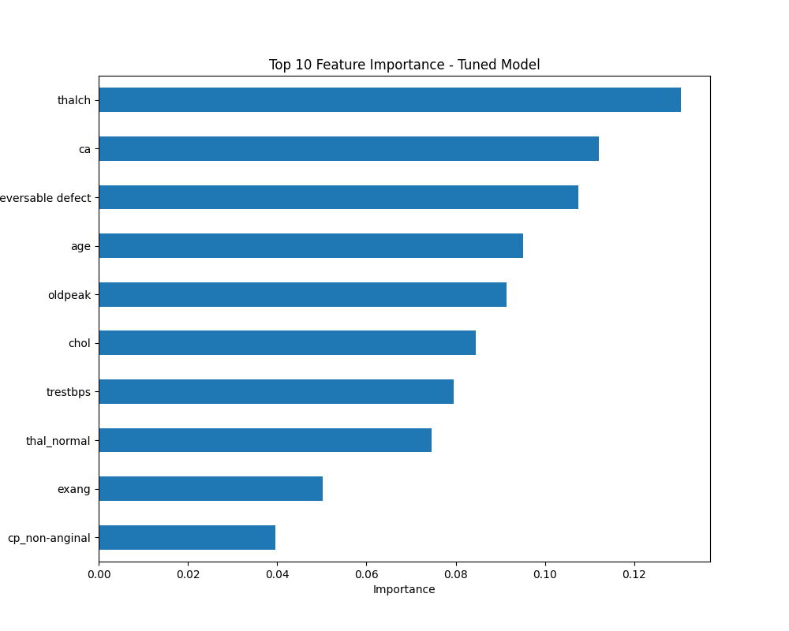

# Heart Disease Prediction
## Overview
Built a machine learning model to predict heart disease using the UCI Heart Disease (Cleveland) dataset. Applied data preprocessing, trained a tuned Random Forest with SMOTE, and visualized results. By Jasmine Presilla J and Karthick E.

## Dataset
- Source: [Kaggle UCI Heart Disease](https://www.kaggle.com/datasets/redwankarimsony/heart-disease-data)
- Features: Age, cholesterol, maximum heart rate, etc.
- Target: Heart disease (0 = no, 1 = yes)

## Methodology
- Preprocessing: Imputed missing values, encoded categorical variables, scaled features.
- Model: Tuned Random Forest with SMOTE and class weights.
- Evaluation: Accuracy, precision, recall, F1-score.
- Visualizations: Confusion matrix, feature importance.

## Results
- Tuned Random Forest: 82% accuracy, 0.83 recall for heart disease.
- Key predictors: Maximum heart rate, number of vessels, thalassemia defects.

## Visualizations



## Setup
```bash
pip install -r requirements.txt
jupyter notebook Heart_disease_prediction.ipynb